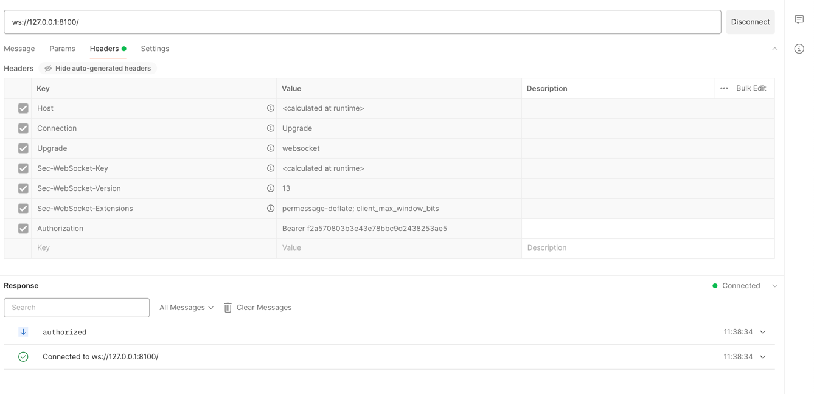
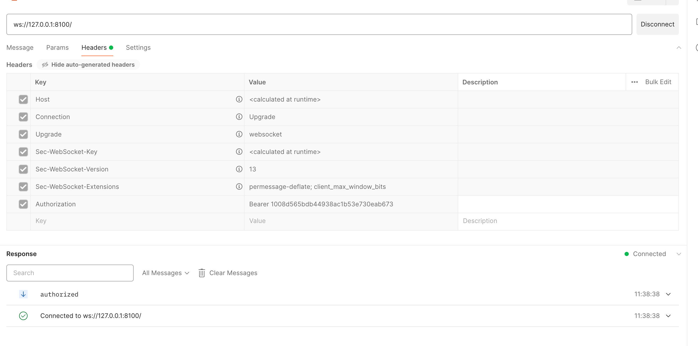
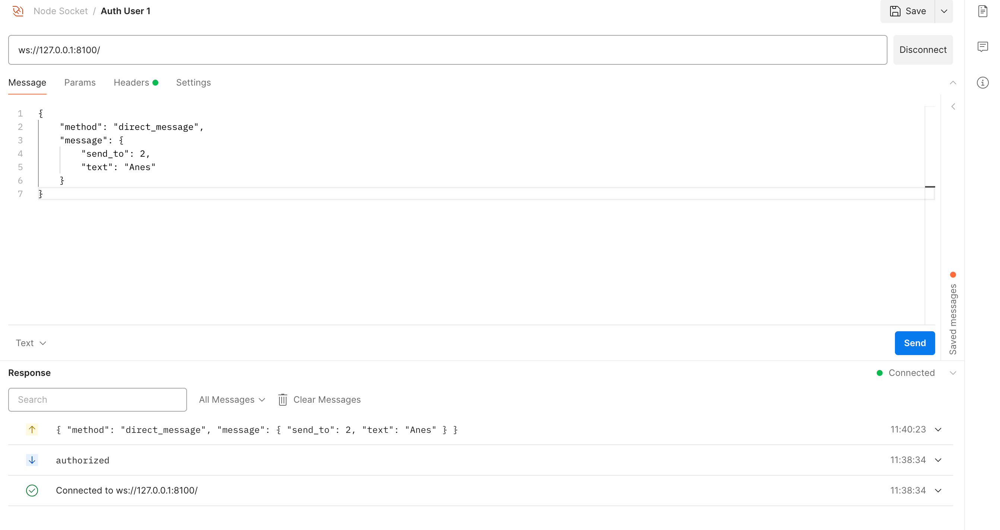
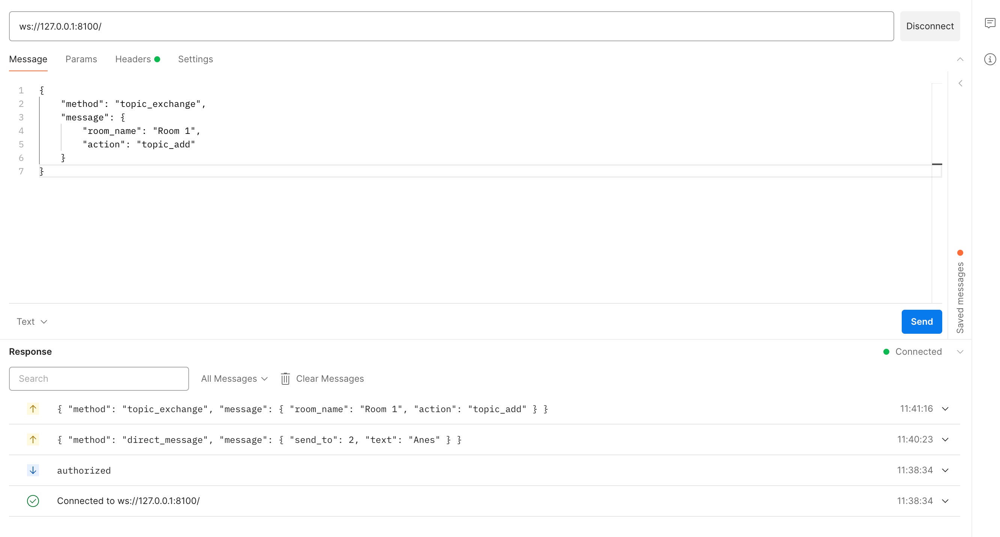
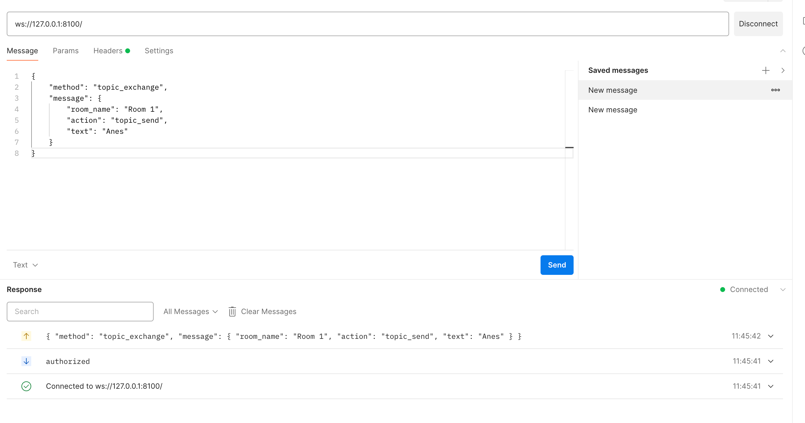
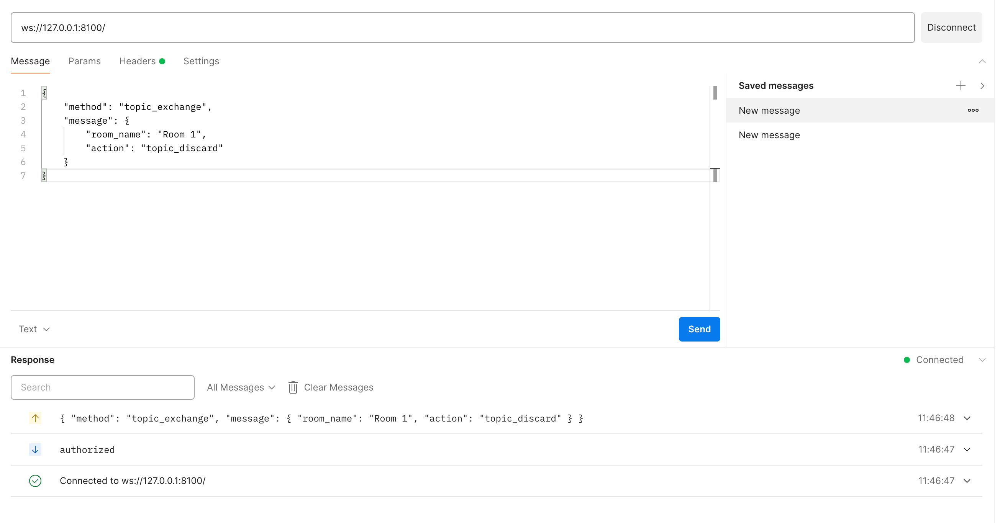

# Mrksocket

---

## Getting started
This project consists of two applications that are connected via RabbitMQ and 
simulates the experimental chat application, which enables multiple other
applications to be integrated in current setup.
* First application named `project` is NodeJS application. 
It provides connection via websockets and connects to the RabbitMQ to 
transfer specific messages to the connected applications on the other side.
* Second application called `example_chat` is Python application, 
which handles messages in the specific way and process them. After that
messages are returned to the RabbitMQ and processed on the `project` app side.

---

## Start setup

- Individual setups can be found in the application
directories with detailed explanation

#### Run all services together

- To run all services together without setting up every application
individually, simply use

```
cd <root project>
docker-compose up --build
```
**_NOTE:_** All applications this way would be running in the hot-reload mode
and use example.docker.env by renaming it to .env

---

### Examples of usage due to lack of feature to extract collection from the Postman

Authorize first user with token:



Authorize second user with token:



Send message from first user to the second user with direct chat option:



Add first user to the topic, you should add the second user this way as well:



Send message in the topic/room:



Leave the topic/room:


